# SCHEMA.md — База данных `relanding_derelandingdb`

## 1. Обзор

База данных **relanding_derelandingdb** обслуживает AI-экосистему для управления лендингами, CRM, аналитикой и чат-ботами, ориентированную на немецкий Mittelstand (малый и средний бизнес). Сервер: MariaDB 10.6, charset: `utf8mb4`.

**Основные подсистемы:**
- **CRM** — организации, клиенты, лиды, тикеты, задачи, события, комментарии
- **Аналитика** — сессии, page views, события, ежедневная/часовая статистика, география
- **Контент/Рендеринг** — кэш страниц, тем, FAQ, бизнес-факты
- **AI/Chat** — интенты, промпт-профили, шаблоны, обратная связь, AI-анализ событий
- **Пользователи и роли** — пользователи, организации, роли (RBAC), приглашения
- **Уведомления/Outbox** — логи уведомлений, исходящие сообщения, очередь задач

---

## 2. ER-диаграмма

```mermaid
erDiagram
    organizations ||--o{ organization_sources : "has sources"
    organizations ||--o| business_profiles : "has profile"
    organizations ||--o{ business_facts : "has facts"
    organizations ||--o{ client_config : "has configs"
    organizations ||--o{ user_organization_roles : "has user roles"
    organizations ||--o{ events : "receives events"
    organizations ||--o{ leads : "via events"
    organizations ||--o{ invite : "has invites"
    organizations ||--o{ client_organization : "has clients"
    organizations ||--o{ notification_log : "has notifications"
    organizations ||--o{ outbox : "has outbox"
    organizations ||--o{ prompt_profiles : "has prompt profiles"
    organizations ||--o{ prompt_templates : "has prompt templates"
    organizations ||--o{ conversation_feedback : "has feedback"
    organizations ||--o{ org_comments : "has comments"
    organizations ||--o{ analytics_daily_reports : "has reports"
    organizations ||--o{ analytics_events : "has analytics events"
    organizations ||--o{ user_sessions : "has sessions"
    organizations ||--o{ website_analytics : "has web analytics"
    organizations ||--o{ website_daily_stats : "has daily stats"
    organizations ||--o{ website_hourly_stats : "has hourly stats"
    organizations ||--o{ attachments : "has attachments"
    organizations ||--o{ queue_tasks : "has queue tasks"

    organization_sources ||--o{ org_comments : "has comments"
    organization_sources ||--o{ prompt_profiles : "for source"
    organization_sources ||--o{ prompt_templates : "for source"
    organization_sources ||--o{ business_facts : "for source"
    organization_sources ||--o{ faq_entries : "for source"

    users ||--o{ user_organization_roles : "has org roles"
    users ||--o{ comments : "creates"
    users ||--o{ leads : "assigned to"
    user_organization_roles ||--o{ user_roles : "has roles"
    roles ||--o{ user_roles : "assigned via"

    clients ||--o{ client_organization : "belongs to orgs"
    clients ||--o{ events : "generates events"
    clients ||--o{ leads : "has leads"
    clients ||--o{ tickets : "has tickets"
    clients ||--o{ comments : "has comments"
    clients ||--o{ outbox : "receives messages"

    events ||--o| event_ai_analysis : "analyzed by AI"
    events ||--o{ event_logs : "has logs"
    events ||--o{ form_fields : "has form fields"
    events ||--o{ comments : "has comments"
    events ||--o{ attachments : "has attachments"
    events ||--o{ leads : "creates lead"
    events ||--o{ tickets : "creates ticket"
    events ||--o{ tasks : "creates task"
    events ||--o{ outbox : "generates outbox"

    chat_intents ||--o{ prompt_templates : "has templates"
    faq_entries ||--o| faq_entries : "merged to"

    user_segments ||--o{ segment_theme_mapping : "mapped"
    user_segments ||--o{ user_sessions : "segment"
```

---

## 3. Таблицы

### 3.1 `organizations`
**Назначение:** Центральная таблица организаций (мультитенантность).

| Колонка | Тип | Nullable | Default | Описание |
|---------|-----|----------|---------|----------|
| id | int(11) | NO | AUTO_INCREMENT | PK |
| name | varchar(255) | NO | — | Название организации |
| chat_id | bigint(20) | YES | NULL | Telegram chat ID группы |
| terms_url | varchar(255) | YES | NULL | URL пользовательского соглашения |
| privacy_url | varchar(255) | YES | NULL | URL политики конфиденциальности |
| token | varchar(32) | YES | NULL | API-токен организации |
| bot_token | varchar(255) | YES | NULL | Telegram bot token |
| model_id | varchar(100) | YES | NULL | ID AI-модели |
| auto_reply_mode | enum | NO | 'manual' | Режим автоответов |
| assignment_mode | enum | NO | 'manual' | Режим назначения задач |
| created_at | timestamp | YES | current_timestamp() | Дата создания |
| level | enum | NO | 'basic' | Уровень подписки |
| is_active | tinyint(1) | YES | 1 | Активна ли организация |

**Ключи:** PK(`id`), UNIQUE(`name`), UNIQUE(`token`), INDEX(`chat_id`), INDEX(`name`), INDEX(`level`, `is_active`)

---

### 3.2 `organization_sources`
**Назначение:** Источники данных организации (email, сайт, телеграм и т.д.).

| Колонка | Тип | Nullable | Default | Описание |
|---------|-----|----------|---------|----------|
| id | int(11) | NO | AUTO_INCREMENT | PK |
| organization_id | int(11) | NO | — | FK → organizations |
| source_type | enum | NO | — | Тип источника |
| source_value | varchar(500) | NO | — | Значение (email, домен и т.д.) |
| role | varchar(50) | YES | NULL | Роль источника |
| config | longtext (JSON) | YES | NULL | Конфигурация |
| is_confirmed | tinyint(1) | YES | 0 | Подтверждён ли |
| confirm_token | varchar(255) | YES | NULL | Токен подтверждения |
| source_name | varchar(255) | YES | NULL | Отображаемое имя |
| source_url | varchar(500) | YES | NULL | URL источника |
| is_active | tinyint(1) | YES | 1 | Активен ли |
| has_api | tinyint(1) | NO | 0 | Есть ли API |

**Ключи:** PK(`id`), UNIQUE(`organization_id`, `source_type`, `source_value`), INDEX(`source_type`, `is_active`)
**FK:** `organization_id` → `organizations(id)` ON DELETE CASCADE

---

### 3.3 `users`
**Назначение:** Пользователи системы (привязка через Telegram).

| Колонка | Тип | Nullable | Default | Описание |
|---------|-----|----------|---------|----------|
| id | int(11) | NO | AUTO_INCREMENT | PK |
| telegram_id | bigint(20) | NO | — | Telegram user ID |
| telegram_name | varchar(255) | YES | NULL | Telegram username |
| name | varchar(255) | NO | — | Имя пользователя |
| email | varchar(255) | YES | NULL | Email |
| language | varchar(5) | YES | 'orig' | Язык интерфейса |
| created_at | timestamp | YES | current_timestamp() | Дата регистрации |
| password_hash | varchar(64) | YES | NULL | Хеш пароля |
| timezone | varchar(50) | YES | NULL | Часовой пояс |

**Ключи:** PK(`id`)

---

### 3.4 `user_organization_roles`
**Назначение:** Связь пользователь ↔ организация с уровнем доступа.

| Колонка | Тип | Nullable | Default | Описание |
|---------|-----|----------|---------|----------|
| id | int(11) | NO | AUTO_INCREMENT | PK |
| user_id | int(11) | NO | — | FK → users |
| organization_id | int(11) | NO | — | FK → organizations |
| level | enum | YES | 'junior' | Уровень |
| addition | varchar(20) | YES | NULL | Доп. пометка |
| workload | int(11) | NO | 0 | Текущая нагрузка |
| created_at | timestamp | YES | current_timestamp() | Дата назначения |
| receives_site_analytics | tinyint(1) | YES | 0 | Получает ли аналитику |

**Ключи:** PK(`id`), UNIQUE(`user_id`, `organization_id`), INDEX(`organization_id`)
**FK:** `user_id` → `users(id)` ON DELETE CASCADE, `organization_id` → `organizations(id)` ON DELETE CASCADE

---

### 3.5 `roles`
**Назначение:** Справочник ролей (CEO, CTO, Developer, SEO и т.д.).

| Колонка | Тип | Nullable | Default | Описание |
|---------|-----|----------|---------|----------|
| id | int(11) | NO | AUTO_INCREMENT | PK |
| role_name | varchar(50) | NO | — | Название роли |

**Ключи:** PK(`id`), UNIQUE(`role_name`)

---

### 3.6 `user_roles`
**Назначение:** Связь user_organization_roles ↔ roles (N:M).

| Колонка | Тип | Nullable | Default | Описание |
|---------|-----|----------|---------|----------|
| user_org_id | int(11) | NO | — | FK → user_organization_roles |
| role_id | int(11) | NO | — | FK → roles |

**Ключи:** PK(`user_org_id`, `role_id`), INDEX(`role_id`)
**FK:** `user_org_id` → `user_organization_roles(id)` ON DELETE CASCADE, `role_id` → `roles(id)` ON DELETE CASCADE

---

### 3.7 `clients`
**Назначение:** Клиенты (контакты, лиды).

| Колонка | Тип | Nullable | Default | Описание |
|---------|-----|----------|---------|----------|
| id | int(11) | NO | AUTO_INCREMENT | PK |
| telegram_id | bigint(20) | YES | NULL | Telegram ID клиента |
| telegram_name | varchar(255) | YES | NULL | Telegram username |
| name | varchar(255) | NO | — | Имя |
| email | varchar(255) | YES | NULL | Email |
| phone | varchar(20) | YES | NULL | Телефон |
| created_at | timestamp | YES | current_timestamp() | Дата создания |

**Ключи:** PK(`id`), UNIQUE(`email`), INDEX(`telegram_id`)

---

### 3.8 `client_organization`
**Назначение:** Связь клиент ↔ организация (N:M) с ролью и статусом.

| Колонка | Тип | Nullable | Default | Описание |
|---------|-----|----------|---------|----------|
| id | int(11) | NO | AUTO_INCREMENT | PK |
| client_id | int(11) | NO | — | FK → clients |
| organization_id | int(11) | NO | — | FK → organizations |
| role | enum | NO | 'customer' | Роль клиента в организации |
| status | enum | YES | 'active' | Статус связи |
| created_at | timestamp | YES | current_timestamp() | Дата создания |

**Ключи:** PK(`id`), UNIQUE(`client_id`, `organization_id`), INDEX(`organization_id`)
**FK:** `client_id` → `clients(id)` ON DELETE CASCADE, `organization_id` → `organizations(id)` ON DELETE CASCADE

---

### 3.9 `client_config`
**Назначение:** Конфигурация клиентского виджета (домен + токен).

| Колонка | Тип | Nullable | Default | Описание |
|---------|-----|----------|---------|----------|
| id | int(11) | NO | AUTO_INCREMENT | PK |
| organization_id | int(11) | NO | — | FK → organizations |
| domain | varchar(255) | NO | — | Домен |
| token | varchar(255) | NO | — | Токен аутентификации |
| is_active | tinyint(1) | YES | 1 | Активен ли |
| created_at | timestamp | YES | current_timestamp() | Дата создания |

**Ключи:** PK(`id`), UNIQUE(`domain`), UNIQUE(`token`)

---

### 3.10 `events`
**Назначение:** Входящие события из всех каналов (email, chat, формы и т.д.).

| Колонка | Тип | Nullable | Default | Описание |
|---------|-----|----------|---------|----------|
| id | int(11) | NO | AUTO_INCREMENT | PK |
| external_id | varchar(255) | YES | NULL | Внешний идентификатор |
| source_type | enum | NO | — | Тип источника |
| source_value | varchar(255) | NO | — | Значение источника |
| from_name | varchar(255) | YES | NULL | Имя отправителя |
| from_contact | varchar(128) | YES | NULL | Контакт отправителя |
| client_id | int(11) | YES | NULL | FK → clients |
| organization_id | int(11) | YES | NULL | FK → organizations |
| subject | text | YES | NULL | Тема |
| message | mediumtext | YES | NULL | Содержание |
| received_at | timestamp | YES | current_timestamp() | Время получения |
| is_first_contact | tinyint(1) | YES | 1 | Первый контакт? |
| preferred_channel | enum | YES | NULL | Предпочтительный канал ответа |
| related_type | varchar(20) | YES | NULL | Тип связанной сущности |
| related_id | int(11) | YES | NULL | ID связанной сущности |

**Ключи:** PK(`id`), INDEX(`organization_id`), INDEX(`client_id`), INDEX(`related_type`, `related_id`), INDEX(`client_id`, `received_at`)
**FK:** `client_id` → `clients(id)` ON DELETE SET NULL, `organization_id` → `organizations(id)` ON DELETE SET NULL

---

### 3.11 `event_ai_analysis`
**Назначение:** AI-анализ входящих событий (тональность, срочность, намерение).

| Колонка | Тип | Nullable | Default | Описание |
|---------|-----|----------|---------|----------|
| id | int(11) | NO | AUTO_INCREMENT | PK |
| event_id | int(11) | NO | — | FK → events (UNIQUE) |
| ai_type | enum | YES | 'new' | Тип сообщения |
| ai_intent | enum | YES | NULL | Намерение |
| ai_tone | enum | YES | NULL | Тональность |
| ai_urgency | enum | YES | NULL | Срочность |
| ai_confidence | float | YES | NULL | Уверенность AI |
| ai_recommended_action | enum | YES | 'manual_review' | Рекомендованное действие |
| ai_summary | text | YES | NULL | Краткое описание |
| processed_at | datetime | YES | current_timestamp() | Время обработки |

**Ключи:** PK(`id`), UNIQUE(`event_id`)
**FK:** `event_id` → `events(id)` ON DELETE CASCADE

---

### 3.12 `event_logs`
**Назначение:** Лог действий над событиями.

| Колонка | Тип | Nullable | Default | Описание |
|---------|-----|----------|---------|----------|
| id | int(11) | NO | AUTO_INCREMENT | PK |
| event_id | int(11) | YES | NULL | FK → events |
| action | varchar(100) | YES | NULL | Действие |
| actor | varchar(100) | YES | NULL | Кто выполнил |
| details | longtext (JSON) | YES | NULL | Детали |
| created_at | datetime | YES | current_timestamp() | Время |

**Ключи:** PK(`id`), INDEX(`event_id`)
**FK:** `event_id` → `events(id)` ON DELETE SET NULL

---

### 3.13 `leads`
**Назначение:** Лиды (потенциальные клиенты).

| Колонка | Тип | Nullable | Default | Описание |
|---------|-----|----------|---------|----------|
| id | int(11) | NO | AUTO_INCREMENT | PK |
| event_id | int(11) | YES | NULL | FK → events |
| client_id | int(11) | YES | NULL | FK → clients |
| assigned_to | int(11) | YES | NULL | FK → users |
| status | enum | YES | 'new' | Статус лида |
| description | text | YES | NULL | Описание |
| created_at | timestamp | YES | current_timestamp() | Дата создания |
| updated_at | timestamp | YES | current_timestamp() ON UPDATE | Дата обновления |

**Ключи:** PK(`id`), INDEX(`client_id`), INDEX(`assigned_to`), INDEX(`client_id`, `status`)
**FK:** `assigned_to` → `users(id)` ON DELETE SET NULL, `client_id` → `clients(id)` ON DELETE SET NULL / CASCADE

---

### 3.14 `tickets`
**Назначение:** Тикеты поддержки.

| Колонка | Тип | Nullable | Default | Описание |
|---------|-----|----------|---------|----------|
| id | int(11) | NO | AUTO_INCREMENT | PK |
| event_id | int(11) | YES | NULL | FK → events |
| client_id | int(11) | YES | NULL | FK → clients |
| status | enum | YES | 'open' | Статус тикета |
| priority | enum | YES | 'medium' | Приоритет |
| assigned_to | int(11) | YES | NULL | Назначен на (user ID) |
| description | text | YES | NULL | Описание |
| created_at | datetime | YES | current_timestamp() | Дата создания |

**Ключи:** PK(`id`), INDEX(`event_id`), INDEX(`client_id`), INDEX(`assigned_to`), INDEX(`client_id`, `status`)
**FK:** `event_id` → `events(id)` ON DELETE CASCADE, `client_id` → `clients(id)` ON DELETE SET NULL

---

### 3.15 `tasks`
**Назначение:** Внутренние задачи.

| Колонка | Тип | Nullable | Default | Описание |
|---------|-----|----------|---------|----------|
| id | int(11) | NO | AUTO_INCREMENT | PK |
| event_id | int(11) | YES | NULL | FK → events |
| title | varchar(255) | NO | — | Заголовок |
| description | text | YES | NULL | Описание |
| docs_link | varchar(255) | YES | NULL | Ссылка на документацию |
| assigned_to | int(11) | YES | NULL | Назначен на (user ID) |
| auto_assigned | tinyint(1) | YES | 0 | Авто-назначен? |
| created_by | varchar(50) | YES | 'user' | Кем создана |
| status | enum | NO | 'open' | Статус задачи |
| created_at | datetime | YES | current_timestamp() | Дата создания |
| client_id | int(11) | YES | NULL | ID клиента |

**Ключи:** PK(`id`), INDEX(`event_id`), INDEX(`client_id`), INDEX(`status`, `created_at`)
**FK:** `event_id` → `events(id)` ON DELETE SET NULL

---

### 3.16 `comments`
**Назначение:** Комментарии к лидам, тикетам, задачам.

| Колонка | Тип | Nullable | Default | Описание |
|---------|-----|----------|---------|----------|
| id | int(11) | NO | AUTO_INCREMENT | PK |
| event_id | int(11) | YES | NULL | FK → events |
| target_type | enum | NO | — | Тип цели |
| target_id | int(11) | NO | — | ID цели |
| message | text | NO | — | Текст комментария |
| created_by | int(11) | YES | NULL | FK → users |
| created_at | datetime | YES | current_timestamp() | Дата создания |
| client_id | int(11) | YES | NULL | FK → clients |

**Ключи:** PK(`id`), INDEX(`target_type`, `target_id`), INDEX(`event_id`), INDEX(`created_by`), INDEX(`client_id`)
**FK:** `event_id` → `events(id)` ON DELETE SET NULL, `created_by` → `users(id)` ON DELETE SET NULL, `client_id` → `clients(id)` ON DELETE SET NULL

---

### 3.17 `attachments`
**Назначение:** Файловые вложения к событиям и сущностям.

| Колонка | Тип | Nullable | Default | Описание |
|---------|-----|----------|---------|----------|
| id | int(11) | NO | AUTO_INCREMENT | PK |
| event_id | int(11) | YES | NULL | FK → events |
| organization_id | int(11) | NO | — | FK → organizations |
| related_type | varchar(50) | YES | NULL | Тип связанной сущности |
| related_id | int(11) | YES | NULL | ID связанной сущности |
| filename | varchar(255) | NO | — | Имя файла |
| file_url | text | NO | — | URL файла |
| content_type | varchar(100) | YES | NULL | MIME-тип |
| file_size | int(11) | YES | NULL | Размер в байтах |
| metadata | longtext (JSON) | YES | NULL | Метаданные |
| uploaded_by | int(11) | YES | NULL | Кем загружен |
| created_at | timestamp | YES | current_timestamp() | Дата загрузки |

**Ключи:** PK(`id`), INDEX(`organization_id`, `related_type`, `related_id`), INDEX(`filename`)

---

### 3.18 `form_fields`
**Назначение:** Поля форм из входящих событий.

| Колонка | Тип | Nullable | Default | Описание |
|---------|-----|----------|---------|----------|
| id | int(11) | NO | AUTO_INCREMENT | PK |
| event_id | int(11) | NO | — | FK → events |
| field_name | varchar(255) | NO | — | Имя поля |
| field_value | text | YES | NULL | Значение |
| created_at | timestamp | YES | current_timestamp() | Дата |

**Ключи:** PK(`id`), INDEX(`event_id`)
**FK:** `event_id` → `events(id)` ON DELETE CASCADE

---

### 3.19 `outbox`
**Назначение:** Очередь исходящих сообщений (email, telegram, sms, webhook).

| Колонка | Тип | Nullable | Default | Описание |
|---------|-----|----------|---------|----------|
| id | int(11) | NO | AUTO_INCREMENT | PK |
| event_id | int(11) | YES | NULL | FK → events |
| recipient_type | enum | YES | NULL | Тип получателя |
| recipient | varchar(255) | NO | — | Адрес получателя |
| sender | varchar(255) | YES | NULL | Адрес отправителя |
| sender_type | enum | YES | NULL | Тип отправителя |
| subject | text | YES | NULL | Тема |
| body | text | YES | NULL | Тело сообщения |
| generated_by | enum | YES | 'ai' | Сгенерировано AI или человеком |
| status | enum | YES | 'queued' | Статус отправки |
| created_at | datetime | YES | current_timestamp() | Дата создания |
| client_id | int(11) | YES | NULL | FK → clients |
| organization_id | int(11) | YES | NULL | FK → organizations |

**Ключи:** PK(`id`), INDEX(`event_id`), INDEX(`client_id`), INDEX(`organization_id`)
**FK:** `event_id` → `events(id)` ON DELETE CASCADE, `client_id` → `clients(id)` ON DELETE SET NULL, `organization_id` → `organizations(id)` ON DELETE SET NULL

---

### 3.20 `notification_log`
**Назначение:** Лог уведомлений (Telegram) с метриками отклика.

| Колонка | Тип | Nullable | Default | Описание |
|---------|-----|----------|---------|----------|
| id | int(11) | NO | AUTO_INCREMENT | PK |
| organization_id | int(11) | NO | — | FK → organizations |
| telegram_id | bigint(20) | NO | — | Telegram user ID |
| entity_type | enum | NO | — | Тип сущности |
| entity_id | int(11) | NO | — | ID сущности |
| notification_type | enum | YES | 'new_entity' | Тип уведомления |
| summary_confidence | decimal(3,2) | YES | 0.00 | Уверенность AI-саммари |
| summary_tags | text | YES | NULL | Теги |
| response_time | int(11) | YES | NULL | Время ответа (сек) |
| clicked_action | varchar(100) | YES | NULL | Нажатое действие |
| sent_at | timestamp | YES | current_timestamp() | Время отправки |
| responded_at | timestamp | YES | NULL | Время ответа |

**Ключи:** PK(`id`), INDEX(`organization_id`, `sent_at`), INDEX(`entity_type`, `entity_id`), INDEX(`telegram_id`)

---

### 3.21 `invite`
**Назначение:** Приглашения пользователей в организацию.

| Колонка | Тип | Nullable | Default | Описание |
|---------|-----|----------|---------|----------|
| id | int(11) | NO | AUTO_INCREMENT | PK |
| invitee_nick | varchar(255) | NO | — | Ник приглашённого |
| invitee_name | varchar(255) | NO | — | Имя приглашённого |
| role_name | varchar(50) | NO | — | Название роли |
| organization_id | int(11) | NO | — | FK → organizations |
| organization_name | varchar(255) | NO | — | Название организации |
| inviter_id | bigint(20) | NO | — | Telegram ID пригласившего |
| created_at | timestamp | YES | current_timestamp() | Дата создания |

**Ключи:** PK(`id`), INDEX(`organization_id`)
**FK:** `organization_id` → `organizations(id)` ON DELETE CASCADE

---

### 3.22 `business_profiles`
**Назначение:** Бизнес-профиль организации (описание, услуги, контакты, FAQ).

| Колонка | Тип | Nullable | Default | Описание |
|---------|-----|----------|---------|----------|
| id | int(11) | NO | AUTO_INCREMENT | PK |
| organization_id | int(11) | NO | — | FK → organizations (UNIQUE) |
| description | mediumtext | YES | NULL | Описание бизнеса |
| services | text | NO | — | Услуги |
| contact_info | text | NO | — | Контактная информация |
| faq | text | YES | NULL | FAQ |
| created_at | timestamp | YES | current_timestamp() | Дата создания |

**Ключи:** PK(`id`), UNIQUE(`organization_id`)
**FK:** `organization_id` → `organizations(id)` ON DELETE CASCADE

---

### 3.23 `business_facts`
**Назначение:** Бизнес-факты для AI-генерации контента (JSON-значения с валидностью).

| Колонка | Тип | Nullable | Default | Описание |
|---------|-----|----------|---------|----------|
| id | int(11) | NO | AUTO_INCREMENT | PK |
| organization_id | int(11) | NO | — | FK → organizations |
| source_id | int(11) | YES | NULL | FK → organization_sources |
| page_slug | varchar(128) | YES | NULL | Slug страницы |
| fact_key | varchar(64) | YES | NULL | Ключ факта |
| fact_value | longtext (JSON) | YES | NULL | Значение факта |
| valid_from | date | YES | NULL | Действителен с |
| valid_until | date | YES | NULL | Действителен до |
| is_active | tinyint(1) | YES | 1 | Активен ли |
| created_at | timestamp | YES | current_timestamp() | Дата создания |

**Ключи:** PK(`id`), INDEX(`source_id`), INDEX(`organization_id`, `source_id`, `page_slug`, `fact_key`)
**FK:** `organization_id` → `organizations(id)`, `source_id` → `organization_sources(id)`

---

### 3.24 `chat_intents`
**Назначение:** Интенты для чат-бота (паттерны, обязательные/запрещённые термины).

| Колонка | Тип | Nullable | Default | Описание |
|---------|-----|----------|---------|----------|
| id | int(11) | NO | AUTO_INCREMENT | PK |
| code | varchar(64) | YES | NULL | Уникальный код интента |
| title | varchar(128) | YES | NULL | Название |
| trigger_patterns | longtext (JSON) | YES | NULL | Триггер-паттерны |
| required_terms | longtext (JSON) | YES | NULL | Обязательные термины |
| forbidden_terms | longtext (JSON) | YES | NULL | Запрещённые термины |
| priority | tinyint(4) | YES | 0 | Приоритет |
| fallback_action | varchar(32) | YES | NULL | Действие по умолчанию |
| created_at | timestamp | YES | current_timestamp() | Дата создания |

**Ключи:** PK(`id`), UNIQUE(`code`)

---

### 3.25 `prompt_profiles`
**Назначение:** Профили промптов для AI-генерации (тон, бренд, язык).

| Колонка | Тип | Nullable | Default | Описание |
|---------|-----|----------|---------|----------|
| id | int(11) | NO | AUTO_INCREMENT | PK |
| organization_id | int(11) | NO | — | FK → organizations |
| source_id | int(11) | YES | NULL | FK → organization_sources |
| page_slug | varchar(128) | YES | NULL | Slug страницы |
| title | varchar(128) | YES | NULL | Название профиля |
| lang | enum | YES | 'ru' | Язык |
| tone | varchar(64) | YES | 'профессиональный' | Тон общения |
| brand_voice | text | YES | NULL | Описание голоса бренда |
| static_data | longtext (JSON) | YES | NULL | Статические данные |
| is_active | tinyint(1) | YES | 1 | Активен ли |
| created_at | timestamp | YES | current_timestamp() | Дата создания |

**Ключи:** PK(`id`), INDEX(`source_id`), INDEX(`organization_id`, `source_id`, `page_slug`)
**FK:** `organization_id` → `organizations(id)`, `source_id` → `organization_sources(id)`

---

### 3.26 `prompt_templates`
**Назначение:** Шаблоны промптов, привязанные к интентам.

| Колонка | Тип | Nullable | Default | Описание |
|---------|-----|----------|---------|----------|
| id | int(11) | NO | AUTO_INCREMENT | PK |
| organization_id | int(11) | NO | — | FK → organizations |
| source_id | int(11) | YES | NULL | FK → organization_sources |
| page_slug | varchar(128) | YES | NULL | Slug страницы |
| intent_id | int(11) | NO | — | FK → chat_intents |
| version | varchar(16) | YES | 'v1' | Версия шаблона |
| system_prompt | mediumtext | YES | NULL | Системный промпт |
| few_shots | longtext (JSON) | YES | NULL | Few-shot примеры |
| output_format | longtext (JSON) | YES | NULL | Формат вывода |
| guardrails | text | YES | NULL | Ограничения |
| default_action | varchar(32) | YES | NULL | Действие по умолчанию |
| priority | tinyint(4) | YES | 0 | Приоритет |
| is_active | tinyint(1) | YES | 1 | Активен ли |
| conversion_rate | decimal(5,2) | YES | 0.00 | Конверсия шаблона |
| created_at | timestamp | YES | current_timestamp() | Дата создания |

**Ключи:** PK(`id`), INDEX(`source_id`), INDEX(`intent_id`), INDEX(`organization_id`, `source_id`, `page_slug`, `intent_id`)
**FK:** `organization_id` → `organizations(id)`, `source_id` → `organization_sources(id)`, `intent_id` → `chat_intents(id)`

---

### 3.27 `term_synonyms`
**Назначение:** Справочник синонимов терминов для AI.

| Колонка | Тип | Nullable | Default | Описание |
|---------|-----|----------|---------|----------|
| id | int(11) | NO | AUTO_INCREMENT | PK |
| canonical | varchar(64) | YES | NULL | Каноническая форма |
| synonyms | text | YES | NULL | Синонимы |
| context | varchar(64) | YES | NULL | Контекст использования |
| lang | enum | YES | 'ru' | Язык |
| created_at | timestamp | YES | current_timestamp() | Дата создания |

**Ключи:** PK(`id`)

---

### 3.28 `conversation_feedback`
**Назначение:** Обратная связь от пользователей чат-бота.

| Колонка | Тип | Nullable | Default | Описание |
|---------|-----|----------|---------|----------|
| id | int(11) | NO | AUTO_INCREMENT | PK |
| organization_id | int(11) | YES | NULL | FK → organizations |
| session_id | varchar(64) | YES | NULL | ID сессии |
| question | text | YES | NULL | Вопрос пользователя |
| intent_detected | varchar(64) | YES | NULL | Обнаруженный интент |
| template_used | int(11) | YES | NULL | ID использованного шаблона |
| ai_response | text | YES | NULL | Ответ AI |
| user_rating | tinyint(4) | YES | NULL | Оценка пользователя |
| user_comment | text | YES | NULL | Комментарий пользователя |
| converted | tinyint(1) | YES | 0 | Конвертировался ли |
| created_at | timestamp | YES | current_timestamp() | Дата |

**Ключи:** PK(`id`), INDEX(`organization_id`)
**FK:** `organization_id` → `organizations(id)`

---

### 3.29 `faq_entries`
**Назначение:** FAQ-записи для страниц.

| Колонка | Тип | Nullable | Default | Описание |
|---------|-----|----------|---------|----------|
| id | int(11) | NO | AUTO_INCREMENT | PK |
| page_slug | varchar(255) | NO | — | Slug страницы |
| question | text | NO | — | Вопрос |
| answer | text | NO | — | Ответ |
| lang | varchar(10) | NO | — | Язык |
| merged_to | int(11) | YES | NULL | FK → faq_entries (self-ref) |
| created_at | datetime | YES | current_timestamp() | Дата создания |
| updated_at | datetime | YES | current_timestamp() ON UPDATE | Дата обновления |
| is_active | tinyint(1) | YES | 1 | Активна ли |
| organization_id | int(11) | NO | — | FK → organizations |
| source_id | int(11) | NO | — | FK → organization_sources |

**Ключи:** PK(`id`), INDEX(`page_slug`), INDEX(`merged_to`), INDEX(`source_id`)
**FK:** `merged_to` → `faq_entries(id)` ON DELETE SET NULL, `source_id` → `organization_sources(id)` ON DELETE CASCADE

---

### 3.30 `faq_candidates`
**Назначение:** Кандидаты FAQ (предложения, ожидающие модерации).

| Колонка | Тип | Nullable | Default | Описание |
|---------|-----|----------|---------|----------|
| id | int(11) | NO | AUTO_INCREMENT | PK |
| page_slug | varchar(255) | NO | — | Slug страницы |
| domain | varchar(255) | NO | — | Домен |
| question | text | NO | — | Вопрос |
| answer_suggestion | text | YES | NULL | Предложенный ответ |
| lang | varchar(10) | NO | — | Язык |
| created_at | datetime | YES | current_timestamp() | Дата создания |
| status | enum | YES | 'pending' | Статус модерации |

**Ключи:** PK(`id`), INDEX(`status`, `lang`), INDEX(`page_slug`)

---

### 3.31 `org_comments`
**Назначение:** Комментарии/отзывы на сайте организации.

| Колонка | Тип | Nullable | Default | Описание |
|---------|-----|----------|---------|----------|
| id | int(11) | NO | AUTO_INCREMENT | PK |
| organization_id | int(11) | NO | — | FK → organizations |
| source_id | int(11) | NO | — | FK → organization_sources |
| author_name | varchar(255) | YES | 'Гость' | Имя автора |
| author_email | varchar(255) | YES | NULL | Email автора |
| message | text | YES | NULL | Текст комментария |
| rating | tinyint(1) | YES | NULL | Оценка |
| user_ip | varchar(45) | YES | NULL | IP адрес |
| sentiment | enum | YES | 'neutral' | Тональность (AI) |
| status | enum | YES | 'pending' | Статус модерации |
| is_published | tinyint(1) | YES | 0 | Опубликован ли |
| telegram_message_id | bigint(20) | YES | NULL | ID Telegram-сообщения |
| created_at | timestamp | YES | current_timestamp() | Дата создания |
| updated_at | timestamp | YES | current_timestamp() ON UPDATE | Дата обновления |

**Ключи:** PK(`id`), INDEX(`source_id`), INDEX(`organization_id`, `source_id`), INDEX(`status`), INDEX(`sentiment`)
**FK:** `organization_id` → `organizations(id)` ON DELETE CASCADE, `source_id` → `organization_sources(id)` ON DELETE CASCADE

---

### 3.32 `queue_tasks`
**Назначение:** Очередь фоновых задач (скрипты обработки).

| Колонка | Тип | Nullable | Default | Описание |
|---------|-----|----------|---------|----------|
| id | int(11) | NO | AUTO_INCREMENT | PK |
| script_name | varchar(50) | NO | — | Имя скрипта |
| request_id | int(11) | NO | — | ID запроса |
| organization_id | int(11) | NO | — | ID организации |
| status | enum | YES | 'waiting' | Статус задачи |
| priority | enum | YES | 'medium' | Приоритет |
| created_at | timestamp | YES | current_timestamp() | Дата создания |

**Ключи:** PK(`id`), INDEX(`status`, `priority`, `created_at`)

---

### 3.33 `render_cache`
**Назначение:** Кэш отрендеренных страниц (по домену, slug, языку, устройству).

| Колонка | Тип | Nullable | Default | Описание |
|---------|-----|----------|---------|----------|
| id | bigint(20) UNSIGNED | NO | AUTO_INCREMENT | PK |
| domain | varchar(255) | NO | — | Домен |
| page_slug | varchar(100) | YES | NULL | Slug страницы |
| language | varchar(10) | NO | 'ru' | Язык |
| device_type | enum | NO | — | Тип устройства |
| data | longtext (JSON) | NO | — | Кэшированные данные |
| created_at | datetime | NO | current_timestamp() | Дата создания |
| updated_at | datetime | NO | current_timestamp() ON UPDATE | Дата обновления |

**Ключи:** PK(`id`), UNIQUE(`domain`, `page_slug`, `language`, `device_type`), INDEX(`domain`, `page_slug`, `language`, `device_type`)

---

### 3.34 `render_main_cache`
**Назначение:** Кэш общих данных сайта (соцсети, юридические ссылки, навигация).

| Колонка | Тип | Nullable | Default | Описание |
|---------|-----|----------|---------|----------|
| id | bigint(20) UNSIGNED | NO | AUTO_INCREMENT | PK |
| domain | varchar(255) | NO | — | Домен |
| language | varchar(10) | NO | 'ru' | Язык |
| socialMedia | longtext (JSON) | NO | — | Ссылки на соцсети |
| legal | longtext (JSON) | NO | — | Юридические ссылки |
| navStructure | longtext (JSON) | NO | — | Структура навигации |
| created_at | datetime | NO | current_timestamp() | Дата создания |
| updated_at | datetime | NO | current_timestamp() ON UPDATE | Дата обновления |

**Ключи:** UNIQUE(`domain`, `language`)

---

### 3.35 `render_theme_cache`
**Назначение:** Кэш темы оформления (по домену, языку, устройству).

| Колонка | Тип | Nullable | Default | Описание |
|---------|-----|----------|---------|----------|
| id | bigint(20) UNSIGNED | NO | AUTO_INCREMENT | PK |
| domain | varchar(255) | NO | — | Домен |
| language | varchar(10) | NO | 'ru' | Язык |
| device_type | enum | NO | — | Тип устройства |
| theme | longtext (JSON) | NO | — | Данные темы |
| created_at | datetime | NO | current_timestamp() | Дата создания |
| updated_at | datetime | NO | current_timestamp() ON UPDATE | Дата обновления |

**Ключи:** UNIQUE(`domain`, `language`, `device_type`)

---

### 3.36 `user_sessions`
**Назначение:** Сессии посетителей сайта (полная аналитика).

| Колонка | Тип | Nullable | Default | Описание |
|---------|-----|----------|---------|----------|
| id | int(11) | NO | AUTO_INCREMENT | PK |
| organization_id | int(11) | NO | — | ID организации |
| session_id | varchar(64) | YES | NULL | ID сессии |
| visitor_id | varchar(64) | NO | — | ID посетителя |
| is_anonymous | tinyint(1) | YES | 0 | Анонимный ли |
| ip_address | varchar(45) | NO | — | IP адрес |
| user_agent | text | YES | NULL | User Agent |
| country | varchar(2) | YES | NULL | Код страны |
| region | varchar(100) | YES | NULL | Регион |
| city | varchar(100) | YES | NULL | Город |
| language | varchar(10) | YES | 'ru' | Язык |
| device_type | enum | YES | 'desktop' | Тип устройства |
| browser | varchar(50) | YES | NULL | Браузер |
| os | varchar(50) | YES | NULL | ОС |
| screen_resolution | varchar(20) | YES | NULL | Разрешение экрана |
| source | varchar(50) | YES | 'direct' | Источник трафика |
| utm_source | varchar(100) | YES | NULL | UTM source |
| utm_medium | varchar(100) | YES | NULL | UTM medium |
| utm_campaign | varchar(100) | YES | NULL | UTM campaign |
| utm_content | varchar(100) | YES | NULL | UTM content |
| utm_term | varchar(100) | YES | NULL | UTM term |
| referrer | text | YES | NULL | Реферер |
| landing_page | varchar(255) | YES | NULL | Страница входа |
| exit_page | varchar(255) | YES | NULL | Страница выхода |
| segment_id | int(11) | YES | NULL | FK → user_segments |
| is_returning | tinyint(1) | YES | 0 | Вернувшийся ли |
| page_views | int(11) | YES | 1 | Просмотры страниц |
| session_duration | int(11) | YES | 0 | Длительность (сек) |
| bounce | tinyint(1) | YES | 1 | Отказ |
| created_at | timestamp | YES | current_timestamp() | Начало сессии |
| last_activity | timestamp | YES | current_timestamp() ON UPDATE | Последняя активность |

**Ключи:** PK(`id`), INDEX(`organization_id`, `created_at`), INDEX(`session_id`, `visitor_id`), INDEX(`visitor_id`, `created_at`), INDEX(`device_type`, `source`), INDEX(`created_at`)

---

### 3.37 `page_views`
**Назначение:** Просмотры страниц в рамках сессий.

| Колонка | Тип | Nullable | Default | Описание |
|---------|-----|----------|---------|----------|
| id | int(11) | NO | AUTO_INCREMENT | PK |
| session_id | varchar(64) | NO | — | ID сессии |
| visitor_id | varchar(64) | NO | — | ID посетителя |
| page_slug | varchar(255) | NO | — | Slug страницы |
| page_title | varchar(255) | YES | NULL | Заголовок страницы |
| page_url | text | NO | — | URL страницы |
| time_on_page | int(11) | YES | 0 | Время на странице (сек) |
| scroll_depth | int(11) | YES | 0 | Глубина прокрутки (%) |
| exit_intent | tinyint(1) | YES | 0 | Попытка ухода |
| viewed_at | timestamp | YES | current_timestamp() | Время просмотра |

**Ключи:** PK(`id`), INDEX(`session_id`), INDEX(`visitor_id`), INDEX(`page_slug`), INDEX(`viewed_at`)

---

### 3.38 `analytics_events`
**Назначение:** Аналитические события (клики, формы, конверсии и т.д.).

| Колонка | Тип | Nullable | Default | Описание |
|---------|-----|----------|---------|----------|
| id | int(11) | NO | AUTO_INCREMENT | PK |
| organization_id | int(11) | NO | — | ID организации |
| visitor_id | varchar(64) | NO | — | ID посетителя |
| session_id | varchar(64) | YES | NULL | ID сессии |
| event_type | enum | NO | — | Тип события |
| event_category | varchar(100) | YES | NULL | Категория |
| event_action | varchar(100) | YES | NULL | Действие |
| event_label | varchar(255) | YES | NULL | Метка |
| event_value | decimal(10,2) | YES | NULL | Числовое значение |
| event_data | longtext (JSON) | YES | NULL | Доп. данные |
| page_slug | varchar(255) | YES | NULL | Slug страницы |
| element_id | varchar(100) | YES | NULL | ID HTML-элемента |
| element_class | varchar(100) | YES | NULL | CSS-класс элемента |
| created_at | timestamp | YES | current_timestamp() | Время события |

**Ключи:** PK(`id`), INDEX(`visitor_id`), INDEX(`session_id`), INDEX(`event_type`), INDEX(`organization_id`), INDEX(`created_at`)

---

### 3.39 `analytics_daily_reports`
**Назначение:** Лог отправки ежедневных аналитических отчётов.

| Колонка | Тип | Nullable | Default | Описание |
|---------|-----|----------|---------|----------|
| id | int(11) | NO | AUTO_INCREMENT | PK |
| organization_id | int(11) | NO | — | ID организации |
| domain | varchar(255) | NO | — | Домен |
| report_date | date | NO | — | Дата отчёта |
| sent_at | timestamp | YES | current_timestamp() | Время отправки |

**Ключи:** PK(`id`), UNIQUE(`organization_id`, `domain`, `report_date`), INDEX(`organization_id`), INDEX(`report_date`)

---

### 3.40 `analytics_processing_log`
**Назначение:** Лог обработки аналитических данных.

| Колонка | Тип | Nullable | Default | Описание |
|---------|-----|----------|---------|----------|
| id | int(11) | NO | AUTO_INCREMENT | PK |
| organization_id | int(11) | NO | — | ID организации |
| domain | varchar(255) | NO | — | Домен |
| last_processed_time | int(11) | NO | — | Timestamp последней обработки |
| records_processed | int(11) | YES | 0 | Количество обработанных записей |
| processed_at | timestamp | YES | current_timestamp() | Время обработки |

**Ключи:** PK(`id`), UNIQUE(`organization_id`, `domain`), INDEX(`processed_at`)

---

### 3.41 `anonymous_analytics`
**Назначение:** Агрегированная анонимная аналитика (счётчики по дням).

| Колонка | Тип | Nullable | Default | Описание |
|---------|-----|----------|---------|----------|
| id | bigint(20) UNSIGNED | NO | AUTO_INCREMENT | PK |
| domain | varchar(255) | NO | — | Домен |
| event_type | varchar(50) | NO | 'section_view' | Тип события |
| event_date | date | NO | — | Дата |
| device_type | varchar(50) | YES | 'unknown' | Тип устройства |
| language | varchar(10) | YES | 'ru' | Язык |
| page_url | varchar(500) | YES | NULL | URL страницы |
| events_count | int(11) | YES | 1 | Количество событий |
| created_at | timestamp | YES | current_timestamp() | Дата создания |
| updated_at | timestamp | YES | current_timestamp() ON UPDATE | Дата обновления |

**Ключи:** PK(`id`), UNIQUE(`domain`(191), `event_date`, `page_url`(191), `device_type`)

---

### 3.42 `website_analytics`
**Назначение:** Детальная аналитика сессий сайта с конверсиями.

| Колонка | Тип | Nullable | Default | Описание |
|---------|-----|----------|---------|----------|
| id | int(11) | NO | AUTO_INCREMENT | PK |
| organization_id | int(11) | NO | — | FK → organizations |
| domain | varchar(255) | NO | — | Домен |
| session_id | varchar(64) | NO | — | ID сессии |
| visitor_id | varchar(64) | NO | — | ID посетителя |
| is_new_visitor | tinyint(1) | YES | 0 | Новый посетитель |
| is_returning | tinyint(1) | YES | 0 | Вернувшийся |
| device_type | varchar(20) | YES | NULL | Тип устройства |
| browser | varchar(50) | YES | NULL | Браузер |
| os | varchar(50) | YES | NULL | ОС |
| language | varchar(10) | YES | NULL | Язык |
| source | varchar(50) | YES | NULL | Источник |
| utm_source | varchar(100) | YES | NULL | UTM source |
| utm_medium | varchar(100) | YES | NULL | UTM medium |
| utm_campaign | varchar(100) | YES | NULL | UTM campaign |
| referrer | text | YES | NULL | Реферер |
| landing_page | varchar(500) | YES | NULL | Страница входа |
| exit_page | varchar(500) | YES | NULL | Страница выхода |
| session_duration | int(11) | YES | 0 | Длительность (сек) |
| page_views | int(11) | YES | 1 | Просмотры |
| bounce | tinyint(1) | YES | 1 | Отказ |
| has_conversion | tinyint(1) | YES | 0 | Есть конверсия |
| conversion_entity_type | enum | YES | NULL | Тип конверсии |
| conversion_entity_id | int(11) | YES | NULL | ID конверсии |
| form_type | varchar(50) | YES | NULL | Тип формы |
| session_date | date | NO | — | Дата сессии |
| ip_address | varchar(45) | YES | NULL | IP |
| last_processed_time | int(11) | YES | NULL | Timestamp обработки |
| created_at | timestamp | YES | current_timestamp() | Дата создания |
| last_processed_id | int(11) | YES | 0 | ID последней обработки |

**Ключи:** PK(`id`), INDEX(`organization_id`, `domain`), INDEX(`session_date`), INDEX(`session_id`), INDEX(`visitor_id`), INDEX(`has_conversion`, `conversion_entity_type`), INDEX(`source`, `utm_source`), INDEX(`bounce`, `device_type`)
**FK:** `organization_id` → `organizations(id)`

---

### 3.43 `website_daily_stats`
**Назначение:** Агрегированная дневная статистика сайта.

| Колонка | Тип | Nullable | Default | Описание |
|---------|-----|----------|---------|----------|
| id | int(11) | NO | AUTO_INCREMENT | PK |
| organization_id | int(11) | NO | — | ID организации |
| domain | varchar(255) | NO | — | Домен |
| date | date | NO | — | Дата |
| unique_visitors | int(11) | YES | 0 | Уникальные посетители |
| total_sessions | int(11) | YES | 0 | Всего сессий |
| new_visitors | int(11) | YES | 0 | Новые посетители |
| returning_visitors | int(11) | YES | 0 | Вернувшиеся |
| avg_session_duration | decimal(10,2) | YES | 0.00 | Ср. длительность сессии |
| total_time | int(11) | YES | 0 | Общее время (сек) |
| bounce_rate | decimal(5,2) | YES | 0.00 | Показатель отказов (%) |
| pages_per_session | decimal(5,2) | YES | 0.00 | Страниц за сессию |
| source_direct | int(11) | YES | 0 | Прямой трафик |
| source_google | int(11) | YES | 0 | Google |
| source_yandex | int(11) | YES | 0 | Яндекс |
| source_social | int(11) | YES | 0 | Соцсети |
| source_email | int(11) | YES | 0 | Email |
| source_referral | int(11) | YES | 0 | Реферальный |
| source_paid | int(11) | YES | 0 | Платный |
| source_other | int(11) | YES | 0 | Прочий |
| desktop_visitors | int(11) | YES | 0 | Desktop |
| mobile_visitors | int(11) | YES | 0 | Mobile |
| tablet_visitors | int(11) | YES | 0 | Tablet |
| top_country_1 | varchar(2) | YES | NULL | Топ-1 страна |
| top_country_1_count | int(11) | YES | 0 | Кол-во из топ-1 |
| top_country_2 | varchar(2) | YES | NULL | Топ-2 страна |
| top_country_2_count | int(11) | YES | 0 | Кол-во из топ-2 |
| top_country_3 | varchar(2) | YES | NULL | Топ-3 страна |
| top_country_3_count | int(11) | YES | 0 | Кол-во из топ-3 |
| top_page_1 | varchar(255) | YES | NULL | Топ-1 страница |
| top_page_1_views | int(11) | YES | 0 | Просмотры топ-1 |
| top_page_2 | varchar(255) | YES | NULL | Топ-2 страница |
| top_page_2_views | int(11) | YES | 0 | Просмотры топ-2 |
| top_page_3 | varchar(255) | YES | NULL | Топ-3 страница |
| top_page_3_views | int(11) | YES | 0 | Просмотры топ-3 |
| total_conversions | int(11) | YES | 0 | Всего конверсий |
| conversion_rate | decimal(5,2) | YES | 0.00 | Конверсия (%) |
| conversions_leads | int(11) | YES | 0 | Конверсии в лиды |
| conversions_tickets | int(11) | YES | 0 | Конверсии в тикеты |
| conversions_tasks | int(11) | YES | 0 | Конверсии в задачи |
| created_at | timestamp | YES | current_timestamp() | Дата создания |
| updated_at | timestamp | YES | current_timestamp() ON UPDATE | Дата обновления |

**Ключи:** PK(`id`), UNIQUE(`organization_id`, `domain`, `date`), INDEX(`organization_id`), INDEX(`domain`), INDEX(`date`)

---

### 3.44 `website_hourly_stats`
**Назначение:** Почасовая статистика сайта.

| Колонка | Тип | Nullable | Default | Описание |
|---------|-----|----------|---------|----------|
| id | int(11) | NO | AUTO_INCREMENT | PK |
| organization_id | int(11) | NO | — | ID организации |
| domain | varchar(255) | NO | — | Домен |
| date | date | NO | — | Дата |
| hour | tinyint(4) | NO | — | Час (0-23) |
| unique_visitors | int(11) | YES | 0 | Уникальные посетители |
| total_sessions | int(11) | YES | 0 | Всего сессий |
| page_views | int(11) | YES | 0 | Просмотры страниц |
| avg_session_duration | decimal(10,2) | YES | 0.00 | Ср. длительность сессии |
| conversions | int(11) | YES | 0 | Конверсии |
| created_at | timestamp | YES | current_timestamp() | Дата создания |

**Ключи:** PK(`id`), UNIQUE(`organization_id`, `domain`, `date`, `hour`), INDEX(`organization_id`), INDEX(`domain`), INDEX(`date`, `hour`)

---

### 3.45 `visitor_geography`
**Назначение:** Кэш геолокации по IP-адресам.

| Колонка | Тип | Nullable | Default | Описание |
|---------|-----|----------|---------|----------|
| id | int(11) | NO | AUTO_INCREMENT | PK |
| ip_address | varchar(45) | NO | — | IP адрес (UNIQUE) |
| country_code | varchar(2) | YES | NULL | ISO код страны |
| country_name | varchar(100) | YES | NULL | Название страны |
| region | varchar(100) | YES | NULL | Регион |
| city | varchar(100) | YES | NULL | Город |
| timezone | varchar(50) | YES | NULL | Часовой пояс |
| latitude | decimal(10,8) | YES | NULL | Широта |
| longitude | decimal(11,8) | YES | NULL | Долгота |
| isp | varchar(255) | YES | NULL | Провайдер |
| created_at | timestamp | YES | current_timestamp() | Дата создания |
| updated_at | timestamp | YES | current_timestamp() ON UPDATE | Дата обновления |

**Ключи:** PK(`id`), UNIQUE(`ip_address`), INDEX(`ip_address`), INDEX(`country_code`), INDEX(`city`)

---

### 3.46 `user_segments`
**Назначение:** Сегменты пользователей (по устройству, источнику, поведению).

| Колонка | Тип | Nullable | Default | Описание |
|---------|-----|----------|---------|----------|
| id | int(11) | NO | AUTO_INCREMENT | PK |
| name | varchar(100) | NO | — | Системное имя сегмента |
| description | varchar(255) | YES | NULL | Описание |
| created_at | timestamp | NO | current_timestamp() | Дата создания |
| updated_at | timestamp | NO | current_timestamp() ON UPDATE | Дата обновления |

**Ключи:** PK(`id`)

---

### 3.47 `segment_theme_mapping`
**Назначение:** Связь сегментов с темами оформления (N:M).

| Колонка | Тип | Nullable | Default | Описание |
|---------|-----|----------|---------|----------|
| id | int(11) | NO | — | PK |
| segment_id | int(11) | NO | — | ID сегмента |
| theme_id | int(11) | NO | — | ID темы |

**Ключи:** PK(`id`)

---

## 4. Связи между таблицами

### Один-к-одному (1:1)
| Таблица A | Таблица B | Связь |
|-----------|-----------|-------|
| organizations | business_profiles | Каждая организация имеет один бизнес-профиль |
| events | event_ai_analysis | Каждое событие имеет один AI-анализ |

### Один-ко-многим (1:N)
| Родитель | Потомок | Описание |
|----------|---------|----------|
| organizations | organization_sources | Организация → источники |
| organizations | events | Организация → события |
| organizations | invite | Организация → приглашения |
| organizations | notification_log | Организация → уведомления |
| organizations | outbox | Организация → исходящие сообщения |
| organizations | prompt_profiles | Организация → промпт-профили |
| organizations | prompt_templates | Организация → шаблоны промптов |
| organizations | conversation_feedback | Организация → обратная связь |
| organizations | org_comments | Организация → комментарии на сайте |
| organizations | business_facts | Организация → бизнес-факты |
| organizations | website_analytics | Организация → веб-аналитика |
| organizations | website_daily_stats | Организация → дневная статистика |
| organizations | website_hourly_stats | Организация → часовая статистика |
| organizations | queue_tasks | Организация → задачи очереди |
| organizations | attachments | Организация → вложения |
| organization_sources | org_comments | Источник → комментарии |
| organization_sources | prompt_profiles | Источник → промпт-профили |
| organization_sources | prompt_templates | Источник → шаблоны |
| organization_sources | business_facts | Источник → факты |
| organization_sources | faq_entries | Источник → FAQ |
| clients | events | Клиент → события |
| clients | leads | Клиент → лиды |
| clients | tickets | Клиент → тикеты |
| events | event_logs | Событие → логи |
| events | form_fields | Событие → поля форм |
| events | comments | Событие → комментарии |
| events | leads | Событие → лиды |
| events | tickets | Событие → тикеты |
| events | tasks | Событие → задачи |
| events | outbox | Событие → исходящие |
| users | comments | Пользователь → комментарии |
| users | leads | Пользователь → лиды (assigned_to) |
| chat_intents | prompt_templates | Интент → шаблоны |
| faq_entries | faq_entries | Self-ref: merged_to (объединённые FAQ) |

### Многие-ко-многим (N:M)
| Таблица A | Таблица B | Связующая | Описание |
|-----------|-----------|-----------|----------|
| users | organizations | user_organization_roles | Пользователи в организациях |
| user_organization_roles | roles | user_roles | Роли пользователей в организациях |
| clients | organizations | client_organization | Клиенты организаций |
| user_segments | (themes) | segment_theme_mapping | Сегменты → темы |

---

## 5. Enum-значения и справочники

### ENUM-поля

| Таблица | Поле | Допустимые значения |
|---------|------|---------------------|
| organizations | auto_reply_mode | `auto`, `manual` |
| organizations | assignment_mode | `auto`, `manual` |
| organizations | level | `basic`, `pro` |
| organization_sources | source_type | `email`, `phone`, `social`, `website`, `chat`, `telegram`, `other` |
| client_organization | role | `customer`, `partner`, `supplier` |
| client_organization | status | `active`, `inactive`, `pending` |
| events | source_type | `email`, `phone`, `socialMedia`, `websiteComments`, `websiteForm`, `websiteChat`, `websiteReviews`, `chat`, `other` |
| events | preferred_channel | `email`, `telegram`, `sms`, `chat`, `webhook`, `phone` |
| event_ai_analysis | ai_type | `new`, `reply`, `continued`, `forwarded`, `attachment`, `other` |
| event_ai_analysis | ai_intent | `order`, `question`, `complaint`, `feedback`, `cancel`, `error`, `spam`, `check`, `followup` |
| event_ai_analysis | ai_tone | `positive`, `neutral`, `negative` |
| event_ai_analysis | ai_urgency | `low`, `medium`, `high`, `critical` |
| event_ai_analysis | ai_recommended_action | `create_lead`, `create_ticket`, `create_task`, `add_comment`, `archive`, `manual_review` |
| analytics_events | event_type | `click`, `scroll`, `form_submit`, `download`, `video_play`, `conversion`, `custom` |
| leads | status | `new`, `in_progress`, `waiting`, `closed` |
| tickets | status | `open`, `in_progress`, `on_hold`, `resolved`, `closed` |
| tickets | priority | `low`, `medium`, `high`, `critical` |
| tasks | status | `open`, `in_progress`, `under_review`, `completed`, `cancelled` |
| comments | target_type | `lead`, `ticket`, `task` |
| outbox | recipient_type | `email`, `telegram`, `sms`, `chat`, `webhook` |
| outbox | sender_type | `email`, `telegram`, `sms`, `webhook` |
| outbox | generated_by | `ai`, `human` |
| outbox | status | `sent`, `queued`, `failed` |
| notification_log | entity_type | `lead`, `ticket`, `task` |
| notification_log | notification_type | `new_entity`, `comment`, `update` |
| org_comments | sentiment | `positive`, `neutral`, `negative`, `spam` |
| org_comments | status | `pending`, `approved`, `rejected`, `spam` |
| faq_candidates | status | `pending`, `approved`, `merged`, `rejected` |
| prompt_profiles | lang | `ru`, `de`, `en` |
| term_synonyms | lang | `ru`, `de`, `en` |
| queue_tasks | status | `waiting`, `processing`, `completed`, `failed` |
| queue_tasks | priority | `high`, `medium`, `low` |
| render_cache | device_type | `mobile`, `desktop` |
| render_theme_cache | device_type | `mobile`, `desktop` |
| user_sessions | device_type | `desktop`, `mobile`, `tablet`, `bot` |
| user_organization_roles | level | `senior`, `middle`, `junior` |
| website_analytics | conversion_entity_type | `lead`, `ticket`, `task` |

### Справочные таблицы с фиксированными данными

**`roles`** — 52 роли:
`Account Manager`, `Admin`, `Affiliate Manager`, `Animator`, `Automation Specialist`, `Beauty Specialist`, `CEO`, `CFO`, `Chef`, `CIO`, `Cleaning`, `CMO`, `Community Manager`, `Content Manager`, `COO`, `Copywriter`, `CTO`, `Designer`, `Developer`, `Driver`, `Engineer`, `Event Manager`, `Finance`, `Fitness Instructor`, `Fleet Manager`, `HR`, `Legal Consultant`, `Logisics`, `Manager`, `Marketing`, `Massage Therapist`, `Mechanic`, `Medical Specialist`, `Online Tutor`, `Photographer`, `PPC`, `PR`, `Product Manager`, `Project Manager`, `Receptionist`, `Sales`, `Security`, `SEO`, `Service Provider`, `SMM`, `Streaming Host`, `Support Manager`, `Tailor`, `Tattoo Artist`, `Tech Support`, `Training Manager`, `Videographer`

**`user_segments`** — 18 сегментов:
`desktop_new_anonymous_direct`, `mobile_new_anonymous_direct`, `desktop_new_anonymous_organic`, `mobile_new_anonymous_organic`, `desktop_new_anonymous_social`, `mobile_new_anonymous_social`, `desktop_new_direct`, `desktop_returning_direct`, `mobile_new_direct`, `mobile_returning_direct`, `desktop_new_organic`, `mobile_new_organic`, `desktop_new_social`, `mobile_new_social`, `desktop_returning_organic`, `mobile_returning_organic`, `desktop_returning_social`, `mobile_returning_social`

---

## 6. Заметки

### Soft-delete
- Прямого soft-delete (поле `deleted_at`) **нет ни в одной таблице**.
- Деактивация реализована через флаги `is_active` в таблицах: `organizations`, `organization_sources`, `business_facts`, `faq_entries`, `prompt_profiles`, `prompt_templates`, `client_config`.
- Для `org_comments` и `faq_candidates` используется поле `status` для модерации.

### Timestamps
- Почти все таблицы имеют `created_at` (timestamp или datetime, default `current_timestamp()`).
- Таблицы с `updated_at` (ON UPDATE current_timestamp()): `anonymous_analytics`, `org_comments`, `render_cache`, `render_main_cache`, `render_theme_cache`, `visitor_geography`, `website_daily_stats`, `user_segments`, `user_sessions` (через `last_activity`), `faq_entries`.
- `leads` имеет `updated_at` с ON UPDATE current_timestamp().

### Charset / Collation
- Все таблицы: `ENGINE=InnoDB`, `DEFAULT CHARSET=utf8mb4 COLLATE=utf8mb4_general_ci`.
- Некоторые колонки используют `utf8mb4_unicode_ci` (client_config, analytics_processing_log, notification_log, user_sessions, user_segments, org_comments).
- JSON-поля используют `utf8mb4_bin` с CHECK `json_valid()`.

### JSON-поля
Таблицы с JSON-полями (longtext + json_valid CHECK): `analytics_events` (event_data), `attachments` (metadata), `business_facts` (fact_value), `chat_intents` (trigger_patterns, required_terms, forbidden_terms), `event_logs` (details), `organization_sources` (config), `prompt_profiles` (static_data), `prompt_templates` (few_shots, output_format).

### Кэширование рендера
Трёхуровневый кэш: `render_main_cache` (общие данные сайта), `render_theme_cache` (тема по устройству), `render_cache` (полные данные страницы).

### Полиморфные связи (без FK)
- `comments`: `target_type` + `target_id` → lead / ticket / task
- `events`: `related_type` + `related_id` → произвольная сущность
- `attachments`: `related_type` + `related_id` → произвольная сущность
- `notification_log`: `entity_type` + `entity_id` → lead / ticket / task
- `website_analytics`: `conversion_entity_type` + `conversion_entity_id` → lead / ticket / task

### Сервер
- MariaDB 10.6.23 на хостинге one.com
- PHP 8.1.2
